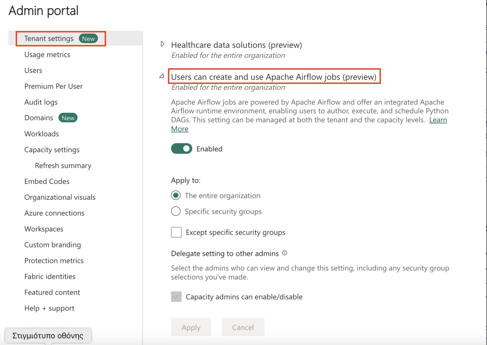
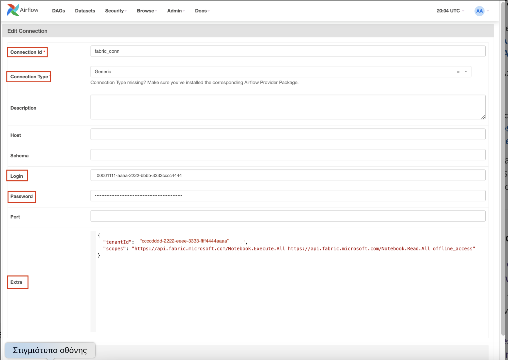

# Setup Airflow in Microsoft Fabric

## Step 1: Enable Apache Airflow Job in your Tenant.
- Go to Admin Portal -> Tenant Settings -> Under Microsoft Fabric -> Expand
- 'Users can create and use Apache Airflow Job (preview)' section.
- Select Apply.



## Step 2: Create a Microsoft Entra ID app.

### 2.1 Register an application in the Microsoft Entra admin center
- Sign in to the Microsoft Entra admin center as at least a Cloud Application Administrator.

- If you have access to multiple tenants, use the Settings icon  in the top menu to switch to the tenant in which you want to register the application from the Directories + subscriptions menu.

- Browse to Identity > Applications > App registrations and select New registration.

- Enter a display Name for your application. Users of your application might see the display name when they use the app, for example during sign-in. You can change the display name at any time and multiple app registrations can share the same name. The app registration's automatically generated Application (client) ID, not its display name, uniquely identifies your app within the identity platform.

- Specify who can use the application, sometimes called its sign-in audience.
  
- Leave Redirect URI (optional) alone for now as you configure a redirect URI in the next section.

- Select Register to complete the initial app registration.

### 2.2 Configure a redirect URI
- After you register your app, you need to configure a redirect URI. The redirect URI is the location in your app where the identity platform sends the authentication response. The redirect URI must be a valid URI that your app can receive and parse.
  
- In the app registration's Overview page, select Add a Redirect URI.
- In authentication tab, under the Platform configurations, select Add a platform, in the open dialog select Mobile and desktop applications.
- In the Redirect URIs section, enter the URI where the identity platform should send the token response. For example, enter https://login.microsoftonline.com/common/oauth2/nativeclient.
- In Supported account types, select Accounts in this organizational directory only (Default Directory only - Single tenant) and then Save.

### 2.3 Add API permissions
- In the app registration's Overview page, select Add a permission.
- Select APIs my organization uses.
- In the search box, enter Power BI Service, choose Power BI Service, and then select application permissions and then tenant.Read.All. and tenant.ReadWrite.All. and then Add permissions.
- Then press Grant admin consent for <your tenant name> button.

### 2.4 Add Owners
- In the app registration's Overview page, select Owners.
- Select Add a owner.
- Search for the user you want to add as an owner and then select Save.

### 2.5 Create a client secret
- In the app registration's Overview page, select Certificates & secrets.
- Press New client secret.
- Enter a description for the client secret in the Description box.
- Select an expiration period for the client secret.
- Press Add.

### 2.6 Create Entra ID Group
- Go to Entrada Admin Portal -> Groups -> Add Group
- Enter the Group Name and Description.
- Add Owners and Members.
- Press Save.

### Step 2.7: Add your Service principal as a "Contributor" in your Microsoft Fabric workspace.
- Go to Admin Portal -> Fabric -> Workspaces -> Select your workspace -> Access Control (IAM) -> Add Role Assignment

### Step 2.8: Enable the Triggerers in data workflows to allow the usage of deferrable operators.

## Step 3: Request authorization and Request an access token


### 3.1.1: Request an authorization code
PKCE (Proof Key for Code Exchange) is recommended. Use the following Python code to generate these:
```python
import base64
import hashlib
import os

# Generate a random code verifier
code_verifier = base64.urlsafe_b64encode(os.urandom(40)).decode('utf-8').rstrip('=')

# Create a code challenge by hashing the verifier
code_challenge = base64.urlsafe_b64encode(
    hashlib.sha256(code_verifier.encode('utf-8')).digest()
).decode('utf-8').rstrip('=')

print("Code Verifier:", code_verifier)
print("Code Challenge:", code_challenge)

```
Save the code_verifier as it will be used later in Step 2 to exchange the authorization code for an access token.

### 3.1.2: Construct the Authorization URL
```
// Line breaks for legibility only
// This request uses Item.Execute.All, Item.Read.All and offline_access scopes. You can update them as per your requirements.


https://login.microsoftonline.com/{tenant}/oauth2/v2.0/authorize?
client_id={client_id}
&response_type=code
&redirect_uri={redirect_uri}
&response_mode=query
&scope=https%3A%2F%2Fapi.fabric.microsoft.com%2FItem.Execute.All%2FItem.Read.All%20offline_access 
&state=12345
&code_challenge=YTFjNjI1OWYzMzA3MTI4ZDY2Njg5M2RkNmVjNDE5YmEyZGRhOGYyM2IzNjdmZWFhMTQ1ODg3NDcxY2Nl
&code_challenge_method=S256
```

### 3.1.3: Redirect the user to the Authorization URL
- The user will be prompted to sign in and consent to the requested permissions.

### 3.1.4: Handle the Authorization Response
- After the user consents, they will be redirected to the redirect_uri with an authorization code in the query string.
- Use the authorization code to exchange for an access token.
- The authorization code is valid for 10 minutes.
- The access token is valid for 1 hour.
  
### 3.1.5: Exchange the authorization code for an access token
- Use Postman or any other tool to make a POST request to the token endpoint.
- Use the following parameters:
```
Post URL: https://login.microsoftonline.com/{tenant}/oauth2/v2.0/token
Headers: Content-Type: application/x-www-form-urlencoded
Body:
client_id={client_id}
grant_type  : authorization_code
code        : {authorization_code}
redirect_uri: {redirect_uri}
code_verifier: {code_verifier}
```

### 3.1.6: Access token response
- The response will contain an access token, refresh token, and id token.
```
HTTP/1.1 200 OK
Content-type: application/json

{
    "token_type": "Bearer",
    "scope": "Mail.Read User.Read",
    "expires_in": 3736,
    "ext_expires_in": 3736,
    "access_token": "eyJ0eXAiOiJKV1QiLCJhbGciOiJSUzI1NiIsIng1dCI6Ik5HVEZ2ZEstZnl0aEV1Q...",
    "refresh_token": "AwABAAAAvPM1KaPlrEqdFSBzjqfTGAMxZGUTdM0t4B4..."
}
```

## Step 4: Set up Apache Airflow connection
Apache Airflow connection is used to store the credentials required to authenticate with Microsoft Fabric APIs.

- Navigate to "View Airflow connections" to add a new Apace Airflow connection.
- Add a new connection and fill the following details:
    - Connection ID: Name of the Connection ID.
    - Connection Type: Generic
    - Login: The Application (client) ID assigned to your app.
    - Password: The refresh token fetched in previous step.
    - Extra: This field contains the following parameters:
        - tenantId: (Required) The {tenant} value in the path of the request can be used to control who can sign into the application.
        - clientSecret: (Optional, only required for web apps) The client secret of the app registration.
        - scopes: (Required) Space separated string of scopes required for the app to access the Microsoft Fabric APIs.

